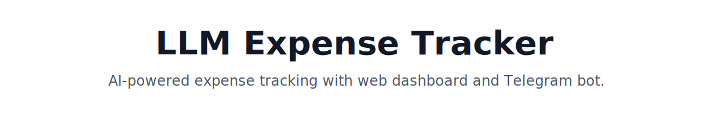
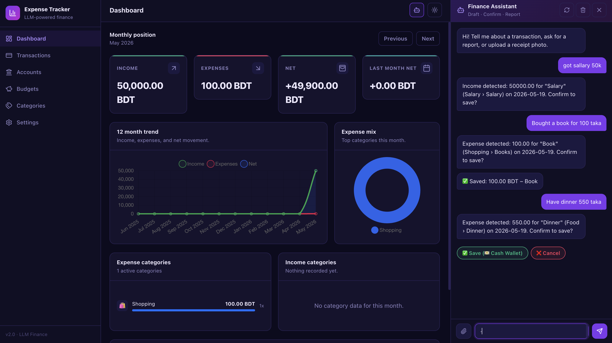
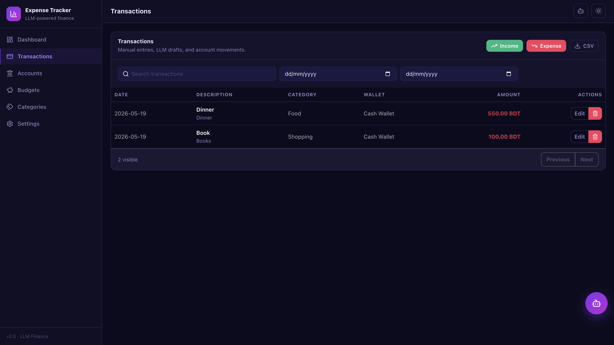
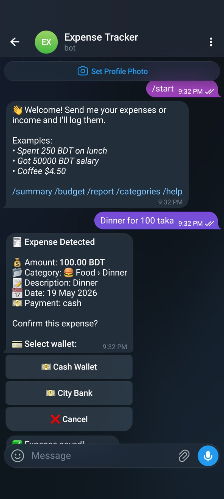
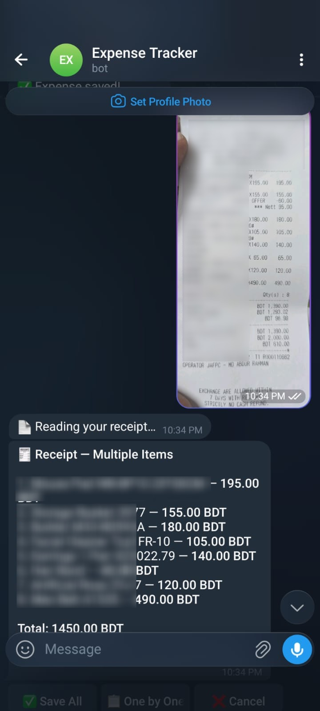
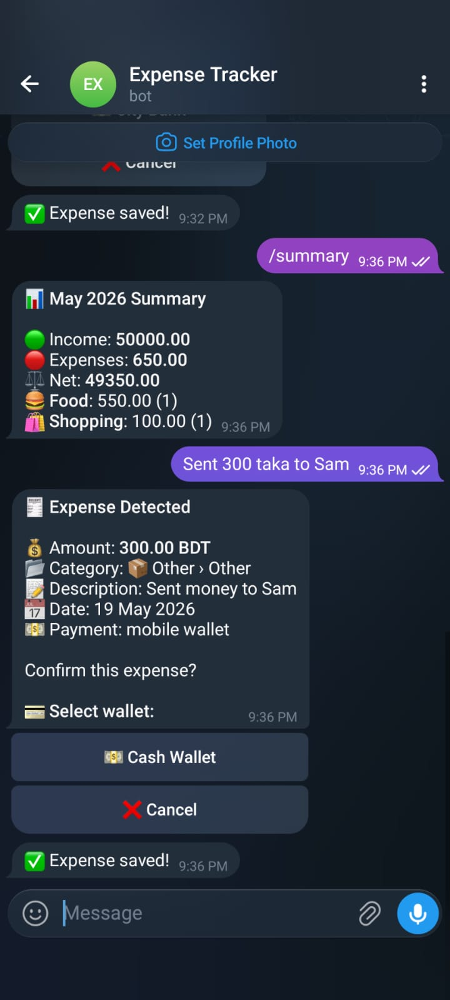

<p align="center">
  
  
  
  
  
  
</p>


An AI-powered personal finance tracker with expense parsing, wallets, budgets, loans[planned], transfers, receipts, web dashboard, and Telegram bot support.

**Describe an expense in plain text → AI extracts the transaction → wallet balance updates automatically.**

---

**Stack:** Go · MySQL · React · Telegram Bot API · Anthropic / OpenAI


> This is an early-stage project that I continue developing in my free time. More features, improvements, and bug fixes will be added gradually.


## Features

- **AI chat (web & Telegram)** — describe transactions in plain text on either interface; LLM extracts amount, category, merchant
- **Receipt parsing** — upload photo or PDF on web or send to bot; AI extracts items automatically
- **Dashboard** — monthly overview, category trends, budget tracking
- **Accounts & transfers** — cash, bank, credit card with balance tracking
- **Budgets** — per-category monthly limits with usage alerts
- **CSV export** — filtered expense export


## Getting Started

```bash
cp .env.example .env   # fill in DB, LLM, and Telegram credentials
make db-create         # create the MySQL database
make migrate-up        # run schema migrations
make dev               # start API (air) + React dev server in parallel
```

**Key `.env` values:**

| Key | Description |
|-----|-------------|
| `DB_*` | MySQL connection |
| `LLM_PROVIDER` | `anthropic` or `openai` |
| `ANTHROPIC_API_KEY` / `OPENAI_API_KEY` | LLM credentials |
| `TELEGRAM_BOT_TOKEN` / `TELEGRAM_CHAT_ID` | Bot credentials |

**Production build:**

```bash
make build             # compiles React into binary, builds Go server → bin/server
make migrate-up
./bin/server
```

## Architecture

```
cmd/
  server/               HTTP server entry point
  migrate/              DB migration runner
internal/
  config/               environment config
  domain/               shared entity types
  llm/                  LLM provider abstraction (Anthropic / OpenAI)
  repository/mysql/     data access layer
  service/
    chat.go             centralized AI decision engine (shared by all transports)
    account|budget|...  business logic per domain
  transport/
    http/
      handler/          REST API handlers
      middleware/       auth, logging
      router.go         route registration
    telegram/
      handler.go        bot polling & infrastructure
      chat.go           message → ChatProcessor → Telegram UI
  worker/               background jobs (budget alerts, scheduler)
  web/                  embedded React build (served by Go)
web/src/                React + Vite source
migrations/             SQL schema files
```

## Screenshots

### Web dashboard



### Transactions



<table>
  <tr>
    <td align="center" width="33%">
      <br>
      <sub>Telegram bot expense flow</sub>
    </td>
    <td align="center" width="33%">
      <br>
      <sub>Receipt image reading</sub>
    </td>
    <td align="center" width="33%">
      <br>
      <sub>Telegram bot wallet summary</sub>
    </td>
  </tr>
</table>
